# annae.tattoo

Static site for Anna Erkhova's permanent makeup studio in Drammen, serving the Greater Oslo region.

Built with plain HTML, Tailwind CSS, and a small `main.js`. No framework, no build step beyond CSS compilation.

## Stack

- **CSS** — Tailwind CSS (`npm run build` / `npm run watch`)
- **Components** — Header and footer loaded via partials (`/partials/`)
- **Booking** — Elfsight appointment widget
- **Analytics** — Google Analytics (only fires on `annae.tattoo`)
- **Hosting** — GitHub Pages

## Development

```bash
npm install
npm run watch   # recompiles CSS on save
```

For a local preview, serve the root directory with any static file server (e.g. `go run server.go`).

## Site map

```mermaid
graph TD
    Home["/ (Home)"]

    Home --> Services["/services"]
    Home --> Price["/price"]
    Home --> Booking["/booking"]
    Home --> Portfolio["/portfolio"]
    Home --> Care["/care"]
    Home --> FAQ["/faq"]
    Home --> Contact["/contact"]

    Services --> PB["/powder-brows"]
    Services --> PL["/permanent-lips"]
    Services --> EL["/eyeliner"]
    Services --> PR["/pmu-restoration"]
    Services --> TR["/tattoo-removal"]

    Home --> Guides["/guide"]
    Guides --> G1["first-pmu-session"]
    Guides --> G2["pmu-pre-care"]
    Guides --> G3["powder-brows-healing"]
    Guides --> G4["lip-blush-healing"]
    Guides --> G5["touch-up-and-refresh"]
    Guides --> G6["pmu-longevity"]
    Guides --> G7["pmu-cost-benefit"]
    Guides --> G8["pmu-active-lifestyle"]
    Guides --> G9["pmu-mature-skin"]
    Guides --> G10["pmu-oily-skin"]
    Guides --> G11["powder-brows-vs-microblading"]
    Guides --> G12["avoid-harsh-brows"]

    Home --> NO["🇳🇴 /no (Norwegian mirror)"]
    NO --> NOServices["/no/services"]
    NO --> NOPrice["/no/price"]
    NO --> NOGuides["/no/guide"]
    NO --> NOBooking["/no/booking"]
    NO --> NOFAQ["/no/faq"]
```



Every EN page has a Norwegian equivalent under `/no/` with `hreflang` alternates declared in `<head>`.

## Content notes

- Pricing, healing timelines, and service descriptions must stay in sync between EN and NO pages
- Schema.org markup (`application/ld+json`) is present on all major pages — keep it consistent with visible copy
- The time savings calculator (`data-calculator` attribute) triggers a modal defined in `main.js`
- Refresh policy: only available to Anna's own clients; other artists' work requires photo assessment first
